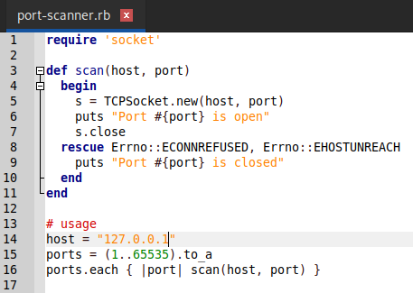
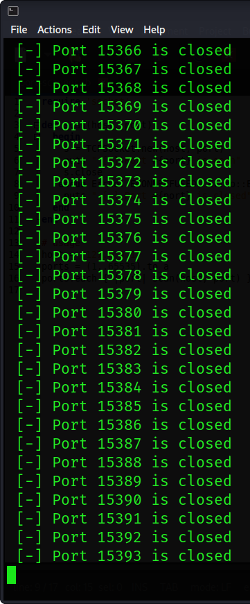

<h1><b>Port Scanner In Ruby</b></h1>
<h2><i>A port scanner is an application designed to probe a server or host for open ports. Such an application may be used by administrators to verify security policies of their networks and by attackers to identify network services running on a host and exploit vulnerabilities.</h1></i>

#
 </a>

#
<h2><b> 😇 Author: Sumalya Chatterjee </b></h2>

#
<h1><b>❤️ Don't Copy, Do Fork 😊</b></h1>

#
<h1><b>Give The IP Address And Port Numbers Before Starting 👇</b></h1>



<h1><b>I Give My Localhost IP Address 👆</b></h1>

#
<h1><b>Result 👇</b></h1>



#
<h1><b>Git Installation </h1></b>

```
# Install Git
sudo apt install git

# Install Ruby
sudo apt install ruby

# Git Clone
git clone https://github.com/R3DHULK/port-scanner-in-ruby

# Change Directory
cd port-scanner-in-ruby

# Run This Tool
ruby port-scanner.rb

```
#
<h2><b><i> Show Support 👇👇👇</b></i> </h2>
<a href="https://www.buymeacoffee.com/r3dhulk"> </a><br><br>

